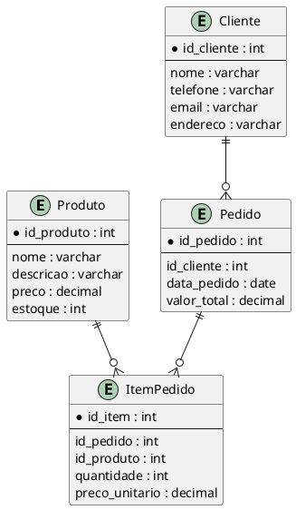

# Papelaria AlguaerPack - Projeto Banco de Dados e Controle de Versão

## 📌 Descrição
Este projeto visa o desenvolvimento de um site para a papelaria AlguaerPack, junto com um banco de dados relacional e o uso do Git para versionamento.

## 🔖 DER (Diagrama Entidade-Relacionamento)


## 🗄️ Código SQL (CREATE TABLE)
```sql
CREATE TABLE Produto (
    id_produto INT AUTO_INCREMENT PRIMARY KEY,
    nome VARCHAR(100) NOT NULL,
    descricao TEXT,
    preco DECIMAL(10,2) NOT NULL,
    estoque INT NOT NULL
);

CREATE TABLE Cliente (
    id_cliente INT AUTO_INCREMENT PRIMARY KEY,
    nome VARCHAR(100) NOT NULL,
    telefone VARCHAR(20),
    email VARCHAR(100),
    endereco TEXT
);

CREATE TABLE Pedido (
    id_pedido INT AUTO_INCREMENT PRIMARY KEY,
    id_cliente INT NOT NULL,
    data_pedido DATE NOT NULL,
    valor_total DECIMAL(10,2),
    FOREIGN KEY (id_cliente) REFERENCES Cliente(id_cliente)
);

CREATE TABLE ItemPedido (
    id_item INT AUTO_INCREMENT PRIMARY KEY,
    id_pedido INT NOT NULL,
    id_produto INT NOT NULL,
    quantidade INT NOT NULL,
    preco_unitario DECIMAL(10,2) NOT NULL,
    FOREIGN KEY (id_pedido) REFERENCES Pedido(id_pedido),
    FOREIGN KEY (id_produto) REFERENCES Produto(id_produto)
);
```

## 🔗 Link do Repositório
[https://github.com/lks2020/papelarials](https://github.com/lks2020/papelarials)
